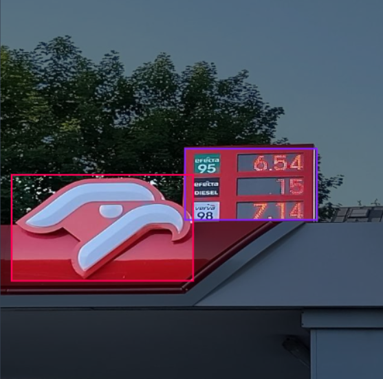

# petrol-prices-object-detection

The aim of this project realized by members of Artificial Intelligence Society [,,Czarna Magia"](https://www.facebook.com/profile.php?id=100093587573194) is to detect petrol [price tags](https://pl.wikipedia.org/wiki/Pylon). This solution should **"help" drivers to decide if they want to refuel their vehicle.** In future it would be beneficial to implement a forecasting model basing on the data collected with the price detection app.

# Introduction

### What is the base line idea?
1. The app gets a picture of a gas station from the user.
2. It detects the price tag (with the use of YOLO v8).
3. Then [OCR](https://en.wikipedia.org/wiki/Optical_character_recognition) is performed to get the numbers out of the detected price tag.
4. We compare whether the price is the lowest in e.g. a month, two weeks, etc. and then the inscription appears whether it is worth buying (in future more advanced methods can be implemented).

To detect the pirce tags we use YOLOv8 architesture from the [`ultralytics`](https://github.com/ultralytics/ultralytics) library implementation.

# Technology

### Components
|  Component  |                                                                                                                                                                  Description                                                                                                                                                                 |
|:-----------:|:--------------------------------------------------------------------------------------------------------------------------------------------------------------------------------------------------------------------------------------------------------------------------------------------------------------------------------------------:|
| `config.yaml` | is a file used for YOLO configuration. To use it, its necessary to add a absolute path to the root directory. Below the paths we need to specify the classes to detect. In the current version of our model there are 3 classes: circlek (Circle K's gas station logo), orlen (Orlen's gas station logo) and prices (detects the price tag). |
| `scripts`     | Folder contains helpful code splited into modules.                                                                                                                                                                                                                                                                                           |
| `demo.ipynb`  | Contains a short demo on how to use ultralytics YOLOv8 model in practice.                                                                                                                                                                                                                                                                    |
| ``.gitignore``  | List of all files that should be ignored by the git repository. If you are not adding such file to your repos, it is worth to change this.                                                                                                                                                                                                   |
| `runs\detect` | contains informations about the training. That is the model weights, confusion matrix (and other helpful images) and the results in a .csv file.                                                                                                                                                                                             |
| `ocr.py`     |                                                                                            

### Labeling the data
For labeling our custom dataset we used different labeling software:
- [cvat](https://app.cvat.ai/)
- [labelImg](https://github.com/heartexlabs/labelImg) - Is a great GitHub repository for labeling images.The greatest adventage of it is the cost, it is free.
- [roboflow](https://universe.roboflow.com/) - Its a website which enables to annotate images. The biggest advantage is a user friendly interface, build in data augmentation and auto labelling (I didn't tested the last for now). It also allows cooparate with your friends during the labeling process. The downside of it is that your dataset will be publicly available if you do not pay a subscription. However, for such small priate projects it is acceptable trade off. Finally I decided to use this labeling tool due to the easy cooperation feature.

### Problems discovered during this project
- Lack of data. As students we do not have an enormous number of labeled petrol prices images.
- Not always the prices are visible on the photo.
- OCR wasn't working on the whole price pylon, so it was necessary to label the specific prices and retrain the model.

### Examples
...
